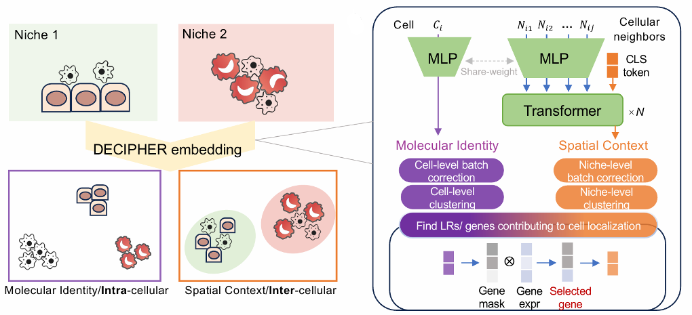

<!-- [](https://github.com/gao-lab/DECIPHER/stargazers) -->
[](https://github.com/gao-lab/DECIPHER/actions/workflows/build.yml)
[](https://github.com/psf/black)
[](https://opensource.org/licenses/MIT)


# DECIPHER
<div align="center">

[Installation](#Installation) • [Documentation](#Documentation) • [Manuscript](#Manuscript) • [FAQ](#FAQ) • [Acknowledgement](#Acknowledgement)

</div>

`DECIPHER` aims to learn cells’ disentangled embeddings from intracellular state and extracellular contexts view based on single-cell spatial omics data.



## Installation
> [!IMPORTANT]
> Requires Python >= 3.10 and CUDA-enabled GPU (not recommend using CPU because it‘s too slow).

### PyPI
We recommend to install `cell-decipher` to a new conda environment with [RAPIDS](https://docs.rapids.ai/install) dependencies.

```sh
mamba create -p ./conda -c conda-forge -c rapidsai -c nvidia python=3.11 rapids=24.04 cuda-version=11.8 cudnn cutensor cusparselt -y && conda activate ./conda
pip install cell-decipher
install_pyg_dependencies
```

### Docker
Build docker image from [Dockerfile](./Dockerfile) or pull the latest image from Docker Hub by:
```sh
docker pull huhansan666666/decipher:latest
```

## Documentation
Here is a minimal example for quick start. Please check our [**documentation**](https://slat.readthedocs.io/en/latest/) for advanced tutorials.

```python
import scanpy as sc
from decipher import DECIPHER

# Init model
model = DECIPHER(work_dir='/path/to/work_dir')

# Register data
adata = sc.read_h5ad('/path/to/adata.h5ad')
model.register_data(adata)

# Fit model
model.fit_omics()

# Get disentangled omics and spatial embeddings
omics_emb = model.center_emb
spatial_emb = model.nbr_emb
```

## Manuscript
TBD

> If you want to repeat our benchmarks and case studies, please check the [**benchmark**](./benchmark/README.md) and [**experiments**](./experiments/README.md) folder.

## FAQ
1. `CUDA out of memory` error

We do all experiments on A100-80G GPUs. We observed `model.train_gene_select()` may use ~40GB for 700,000 cells with 1,000 genes. If your GPU do not have enough memory, you can try running with CPU.


## Acknowledgement
We thank following great open-source projects for their help or inspiration:

- [SimCLR](https://github.com/sthalles/SimCLR)
- [vit-pytorch](https://github.com/lucidrains/vit-pytorch)
- [lightly](https://github.com/lightly-ai/lightly)
- [scib](https://github.com/theislab/scib)
- [rapids_singlecell](https://github.com/scverse/rapids_singlecell/)
